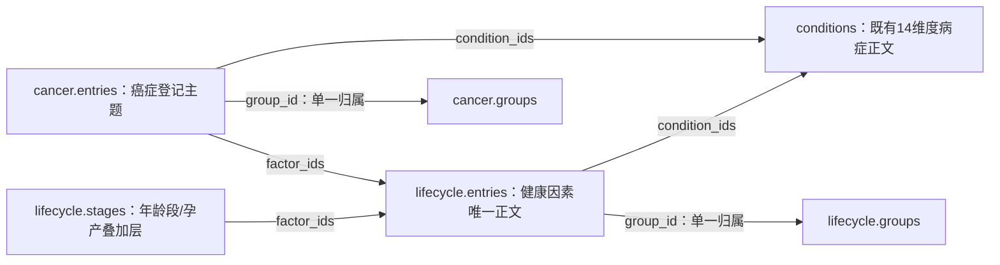

# 已实现的系统架构

## 运行时

浏览器读取单个预构建 HTML，解析内嵌 JSON，构建词法索引。全部计算在当前页面完成，不依赖后端、模型或第三方搜索。页面加载不读取单个 JSON 接口，因此离线使用不受 `file://` 的 fetch 跨源规则影响；浏览器自身仍可能禁止打开文件。

危险提示不受主题筛选或排名影响。它并非经过临床验证的急诊分流；对未覆盖语言和未识别表达，界面始终提醒能力限制。

## 构建时

`data/*.json / data/conditions/*.json / data/knowledge/*.json → load → validate → CSS/JS/JSON 内嵌 → CSP 内容哈希 → index.html`。同一数据和构建日期环境的输出可重复。构建同时更新病症轻量索引与统计审计；数据变更后不应手改生成物。

Python 核心运行时只有标准库。可选 JSON Schema 测试依赖 `jsonschema`。JS 是 ES 模块，构建器只拼接显式列出的运行时模块并移除其模块声明，不是通用 JS bundler；增加复杂导入或多行导入时必须调整构建与回归测试。

`knowledge.py` 加载并验证 `cancer` 与 `lifecycle` 两个独立知识模块，`model.load()` 将它们放在 `data.knowledge` 中。构建器将整个对象嵌入现有 JSON payload；`knowledge.mjs` 位于 `text.mjs` 之后、`app.mjs` 之前，复用安全文本渲染。运行时仍只需一个 HTML，不读取 Desktop 研报或额外 JSON 文件。

## 数据契约

病症的稳定 `id` 与显示名称分离；`kind` 区分疾病与症状；主目录恰好一个；标签允许交叉。病症的 14 维度正文段落包含双语文本、来源 ID 和 `support_status`。当前全部为 `pending_claim_verification`。

14 个核心正文段落：病症概览；病因与风险；危险信号；就医与科室；诊断；鉴别；治疗；药品角色/风险；饮食；日常护理；特殊人群；预后/复发/随访；并发症；预防。症状词、科室 ID、审核、来源、地区和命名是额外结构化字段。

`section.text` 是唯一正文来源。`text.mjs` 将空行和 `- ` 转为安全的段落、列表；卡片只读取概览首段，详情及 CSV 保留全文。详情先显示危险信号，再显示章节目录；比较表可展开完整单元格。所有节点通过 `textContent` 写入，不解析正文 HTML。

`data/department-groups.json` 保持“大科 → 亚科”两级导航，原有科室 ID 不变。一个主题的多个科室关系只产生一个结果，一级总数是子科室主题集合的并集。850px 以下复用同一菜单作为抽屉。切换语言保留查询、筛选、比较选择及当前详情；阿语文字 RTL，侧栏和顶栏仍保持约定的物理位置。

流行病学数值、正式诊断标准、传播详情、定量预后、筛查间隔、地区药品批准、操作适应证等高级字段预留为 null，页面明确未编纂。不可把“预留字段”统计成完成的医学信息。

## 研报知识模块

两份研报转换为独立的教育知识入口，详细映射、原文件路径及 SHA256 见[研报 MECE 映射](research-mece-map.md)。癌症模块采用 34 个登记组加 `other-specified`、`unknown-primary` 两个补充归档项，共 36 项；生命周期模块将复合主题拆成 20 个可复用因素。它们都不写入 `data.conditions`。

每个知识条目只保存一个 `group_id`，条目 ID 在两个模块之间唯一；不同轴之间通过引用连接。模块、条目和阶段的 `sections` 各自维护唯一章节 ID；章节保存双语标题、双语正文和 `source_ids`。条目引用的来源必须存在于本模块 `sources`，条目章节的来源还必须属于该条目的 `source_ids`。模块总论和阶段章节直接引用本模块来源。`condition_ids` 只能指向现有病症；`factor_ids` 只能指向 `lifecycle.entries`。

年龄按整岁闭区间划分为 0–4、5–17、18–39、40–64、65–84、85+ 六组。验证器按上下界检查完整分区，不依赖阶段显示名称或数组顺序。孕前与孕产期使用 `kind=overlay`，上下界均为 `null`，按实际状态与年龄组共同适用，不占第七个年龄区间。阶段正文保留来源本身更细的年龄、人群及地区条件。

`stats.knowledge` 单独统计模块、条目、章节、阶段以及各模块来源等数量。既有 `stats.conditions`、病症章节数、病症来源数、72 条比较对象和 22 列 CSV 契约不变；`data/catalog/index.json` 仍只列病症。知识条目及交叉链接不增加 ICD 覆盖分子。

## 搜索边界

Unicode NFKC、英文小写、中文二元切词和词法 BM25。名称、别名及症状加权支持相关性排序；不做疾病贝叶斯概率、个体诊断、生成式解释、向量数据库或药物处方。拼写纠错和广泛方言召回尚未实现。

当前有限否定范围按标点与少量转折词切分。它不能理解任意复杂自然语言、反讽、病史时间关系、全部否定、所有年龄表达或所有急症。实现修复过将“喘不过气”错误切分为转折句的问题，测试已固定这一回归用例。

## 渐进式读取

Agent 先读取 `data/catalog/index.json` 的标题、分类和路径，再选读 `data/conditions/{id}.json`，最后按 `source_ids` 读取证据登记。全库比较可以读 JSON 或 CSV，不必让模型一次吞下所有段落。没有虚构的 OpenAPI 服务端；这些是静态数据文件。

研报知识另读 `data/knowledge/cancer.json` 或 `data/knowledge/lifecycle.json`，按条目或阶段引用找到相关正文；来源登记保留在各模块内。原始 Markdown 只用于研究追溯，不是另一份运行时正文。

## 两种校验模式

`preview` 检查结构、命名、双语字段、引用、相关主题、日期和内容状态，可构建明确标注的预览。

知识模块的来源采用 HTTPS URL，并记录标题、读取日期及 `scope`；章节引用用于追踪支持范围。模块使用独立的 `review.status=editorial` 和 `updated_at`。结构校验不证明每个医学主张已获支持，来源读取日期也不是医学审核日期。

`clinical` 在此基础上要求每个主题两名已登记且资质标记已核验的专业审核者、内容哈希一致的签审记录、每段至少两个独立来源的定位/哈希支持、翻译签审、明确临床地区、不过期的记录、危险规则验证和独立临床报告。当前必定失败。它检查记录，不验证现实资质真实性、签名所有权、医疗效果或法规资格。

知识模块目前只支持 editorial 编审状态，并独立阻止 `clinical` 构建；即使病症签核完成，也不会自动放行新增模块。将模块标签改成 `medically_reviewed` 会被拒绝。未来医学发布需单独确定与内容和证据绑定的审核流程，再扩展门禁。

## 安全与完整性

用户输入和数据使用 `textContent`；JSON 脚本转义 `<>&` 和分隔符；CSP 以哈希限制可执行脚本/样式；没有远程连接；外部来源仅 HTTPS；CSV 对公式注入做转义。SHA256 清单检出意外改动，**不是数字签名**。无密码、API Key、患者病历或管理员后门。

医学发布记录至少需要一名医生，不能仅由两名药师登记满足整篇疾病主题的发布门槛；这仍不替代真实资质核验。
